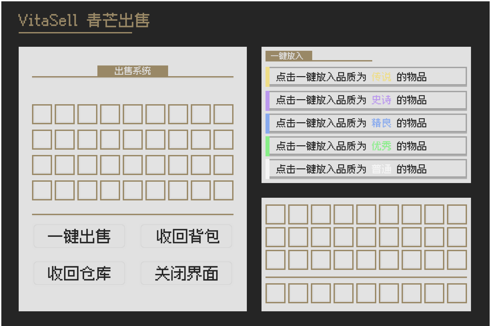

# 🏷 插件介绍

**售价 18R**

**插件购买请联系 2759278070。**

## 主要功能

1. **自定义出售界面**，支持物品在不同界面以不同价格出售
2. **自定义物品匹配规则**，支持 **Arim 物品匹配表达式**
3. **高拓展货币操作**，支持金钱/点券的给予与扣除，可使用 **权重/范围随机**
4. **Kether 脚本支持**，允许通过 Kether **设置出售条件或出售执行操作**
5. **快捷出售功能**，支持将背包内符合条件的物品 **一键放入出售界面**
6. **灵魂背包拓展**，兼容 **QFSoulBag**，允许 **一键出售灵魂背包中符合条件物品**
7. **关闭自动出售**，可设置 **关闭界面时自动出售** 或 **自动存入灵魂背包**
8. **读取 Lore 参数**，自动设置物品出售价格

## 图片展示

